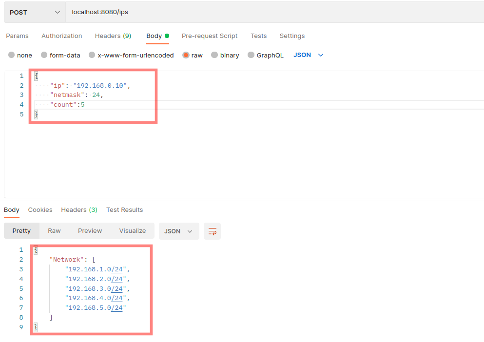

# learn-by-code

## leason 0

Tahap pertama untuk membuat Go project

## Leason 1

Resource scope: variable, struct, function

## Leason 2

* Map
* Function argument
* Function return value
* Function return error
* Named return value

## Leason 3

* Pointers
* Methods
* How to use external package: IPLib

PR :
- Gin-Gonic - Buat sebauh method POST menerima argument pertama IP, kedua netmask, ketiga jumlah banyaknya next subnet.
  kemudian return value berupa json
```
  {
      "ip": "192.168.10.0"
      "netmask": "24"
      "count": 3
  }

result
{
    "ip": "192.168.11.0/24",
    "ip": "192.168.12.0/24",
    "ip": "192.168.13.0/24"
}
```
Refrensi:  https://github.com/c-robinson/iplib

Hasil Test

